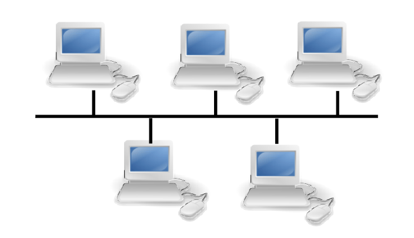
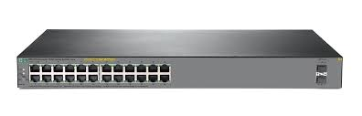

# **Giới thiệu chung về Networking**

## Mục lục

[1. Giới thiệu chung](#gioithieu)

[2. Mạng máy tính](#mangmaytinh)

[3. Phân loại mạng máy tính](#phanloai)

[4. Mô hình OSI](#mohinhosi)

[5. Phân biệt giao thức UDP và TCP](#pbudptcp)

[6. Tìm hiểu về Router, Switch, Hub, Repeater](#timhieuthietbi)

---

## **A. Mạng truyền thông và công nghệ mạng**

<a name="gioithieu">

### **1. Giới thiệu chung**</a>

* **Computer communications** (truyền thông máy tính): là quá trình truyền dữ liệu từ thiết bị này qua thiết bị khác.
* **End system** (các thiết bị gửi nhận đầu cuối): ví dụ Máy tính, điện thoại,...
* **Data** (dữ liệu): trong *networking* được coi là dữ liệu,sự kiện thô chưa được xử lý, ngoài ra **infomation** (thông tin) chỉ việc các sự kiện dữ liệu đó được tổ chức thành dạng thông tin có nghĩa đối với con người.
* **NETWORKING** (Mạng): chỉ các thiết bị kết nối với nhau nhằm trao đổi thông tin, dữ liệu, trong **Networking** gồm có:
    + **`Protocol`** (Giao thức truyền thông): Là các nguyên tắc mà các thành phần mạng phải tuân thủ để có thể trao đổi với nhau
    + **`Topo`** (*Topology* - Mô hình kết nối): Là cách thức các thiết bị kết nối, ví dụ như `Star Topology`, `Ring Topology`, `Bus Topology`.
    + **`Address`** (Địa chỉ) : Cách thức định vị một thiết bị trên mạng.
    + **`Routing`** (Định tuyến): Cách thức dữ liệu truyền từ thiết bị này qua thiết bị khác.
    + **`Reliability`**(Tính tin cậy) : Tính toàn vẹn dữ liệu mà dữ liệu nhận giống chính xác với dữ liệu gửi.
    + **`Interoperability`** (Khả năng liên tác): Chỉ mức độ có thể làm việc của các sản phẩm.
    + **`Security`** (An ninh): Đảm bảo an toàn dữ liệu và các thành phần trong mạng.
    + **`Standard`** (Chuẩn): Thiết lập quy tắc và luật lệ cụ thể.

<a name="mangmaytinh">

### **2. Mạng máy tính** </a>
* Khái niệm: là tập hợp các máy tính và thiết bị kết nối với nhau qua các phương tiện truyền thông mạng.
* Các thành phần mạng: Thiết bị, nút, máy tính.
* Phương tiện và các giao thức xét tới 2 tiêu chí là **khả năng liên kết** (`connectivity`- đường truyền hoặc kết nối vật lý giữa các thành phần) và **ngôn ngữ** (`language`-bảng từ vựng cùng các quy tắc mà thành phần phải tuân thủ).
* Môi trường truyền thông (*Media*) là môi trường vật lý để kết nối các thành phần mạng, bao gồm:
    + Cáp (Cable)
    + Không dây (Wireless)
* Giao thức (**Protocols**): Hiểu đơn giản đó là ngôn ngữ và quy tắc được sử dụng để cách thành phần mạng có thể hiểu nhau.

<a name="phanloai">

### **3. Phân loại mạng máy tính** </a>
* Dựa trên phạm vi:
    + **LAN** (**L**ocal **A**rea **N**etwork - Mạng cục bộ): là mạng tư nhân như một toà nhà, văn phòng, khu vực các máy kết nối tới máy trạm để trao đổi tài nguyên. Mạng **LAN** gồm 3 đặc điểm:
        - Giới hạn phạm vi nhỏ
        - Kỹ thuật đơn giản thường dùng một cáp nối tất cả các máy, tốc độ thường là 10Mbps, 100Mbps, 1Gbps và gần đây có 100Gbps.
        - Các kiến trúc mạng **Lan**: Mạng tuyến(Bus), Mạng vòng(Ring), Mạng sao(Star), Mạng lứoi(Mesh).

    

    + **MAN** (**M**etropolitan **A**rea **N**etwork - Mạng đô thị): Lớn hơn mạng Lan bao gồm nhiều văn phòng, khu vực với nhau, 
        - Mạng này có tối đa 2 dây cáp
        - Không dùng các kỹ thuật nối chuyển
        - Hỗ trợ thêm cả đàm thoại, vận tốc có thể đạt tới 10Gbps.

    

    + **WAN** (**W**ide **A**rea **N**etwork - Mạng diện rộng): Dùng trong vùng địa lý như các quốc gia hay châu lục, mạng con có 2 thành phần chính:
        - Các đường dây vận chuyển còn gọi là mạch (circuit), kênh (channel), hay đường trung chuyển (trunk).
        - Các thiết bị nối chuyển
    
    

    + **GAN** (**G**lobal **A**rea **N**etwork): là mạng của các Wan, trải rộng trên phạm vi toàn cầu

* Dựa trên mô hình xử lý:
    + Mô hình **điểm - điểm** (*point-to-point*): 
        - Ưu điểm: Thiết lập mạng đơn giản, dễ dàng cấu hình lại mạng (thêm, bớt các trạm), dễ dàng kiểm soát và khắc phục sự cố, tận dụng được tối đa tốc độ truyền của đường truyền vật lý.
        - Khuyết điểm: Độ dài đường truyền nối một trạm với thiết bị trung tâm bị hạn chế (bán kính khoảng 100m với công nghệ hiện nay).
 
        Mạng hình sao (star) cho phép nối các máy tính vào một bộ tập trung (hub) bằng cáp xoắn.

         

        Mạng cây (tree) là mô hình phân cấp gồm một nút gốc hoặc 1 hub nối đến các nút mức hai hoặc hub mức 2, các thiết bị ở mức 2 lại nối với các mức 3...

        

    + Mô hình **điểm - nhiều điểm** (*Broadcast*) :
        - Mạng tuyến tính (Bus Network): 
            - Ưu điểm: Dễ thiết kế và chi phí thấp.
            - Khuyết điểm: Tính ổn định kém, chỉ một nút mạng hỏng là toàn bộ mạng bị ngừng hoạt động.

        

        - Mạng vòng: tất cả các nút được nối đến một vòng

        

<a name="mohinhosi">

### **4. Mô hình OSI** </a>

+ **Khái niệm**
    - **Mô hình OSI** (**O**pen **S**ystems **I**nterconnection Reference Model, viết ngắn là OSI Model hoặc OSI Reference Model) - tạm dịch là Mô hình **tham chiếu kết nối hệ thống mở** - là một thiết kế dựa vào nguyên lý tầng cấp, lý giải kỹ thuật kết nối truyền thông giữa các máy vi tính và thiết kế giao thức mạng giữa chúng.
    - Mô hình này được phát triển thành một phần trong kế hoạch **Kết nối các hệ thống mở** (Open Systems Interconnection) do **ISO** và **IUT-T** khởi xướng. Nó còn được gọi là *Mô hình bảy tầng của OSI*.

+ **Mô hình**

    

    - **Application** - Tầng ứng dụng: 
        + Cung cấp giao diện cho ứng dụng và người dùng có thể tương tác thông với chương trình ứng dụng đó, cho phép người dùng truy nhập các thông tin và dữ liệu trên mạng thông qua chương trình ứng dụng
        + Ví dụ các ứng dụng trong tầng này gồm: *Telnet*, Giao thức truyền tập tin *FTP* và Giao thức truyền thư điện tử *SMTP*, *HTTP*, *X.400 Mail remote*.

    - **Presentation** - Tầng trình diễn:   
        + Tại máy gửi tầng này nhận nhiệm vụ nhận dữ liệu từ *tầng ứng dụng* mã hóa chúng thành một dạng chung và nén chúng lại(mục đích làm giảm dữ liệu truyền trên mạng)
        + Tại máy nhận nó dịch dữ liệu nhận được từ *tầng phiên* để đưa về *tầng ứng dụng*.
        + Ví dụ về Presentation bao gồm mã hóa, *ASCII*, *EBCDIC*, *TIFF*, *GIF*, *PICT, JPEG, MPEG, MIDI*.

    - **Session** - Tầng phiên: 
        + Kiểm soát các (phiên) hội thoại giữa các máy tính. Tầng này thiết lập, quản lý và kết thúc các kết nối giữa các trình ứng dụng. 
        + Có trách nhiệm kiểm tra và phục hồi phiên, đây là phần thường không được dùng đến trong bộ giao thức **TCP/IP**.
        + Ví dụ về Session bao gồm *NFS*, *NetBios Name*, *RPC*, *SQL*.

    - **Transport** - Tầng giao vận: 
        + Cung cấp dịch vụ chuyên dụng chuyển dữ liệu giữa thiết bị đầu cuối hoặc các host.  Tầng giao vận kiểm soát độ tin cậy của một kết nối được cho trước.
        + Chịu trách nhiệm cho việc phục hồi lỗi *end-to-end* và kiểm soát luồng từ đầu đến cuối.
        + Ví dụ về lớp transport bao gồm *SPX, TCP, UDP*.

    - **Network** - Tầng mạng: 
        + Lớp này cung cấp các công nghệ chuyển mạch và định tuyến, hay còn được biết đến là các mạch ảo, giúp truyền dữ liệu từ nút mạng này sang nút mạng khác.
        + Tại máy gửi dữ liệu sẽ được chia thành các gói nhỏ để tránh tình trạng kích thước dữ liệu vượt quá dung lượng tối đa của 1 gói, sau đó thực hiện gán cho mỗi gói một thứ tự nhận dạng.
        + Tại máy nhận, khi dữ liệu đến, lớp **Network** sẽ chịu trách nhiệm kiểm tra thứ tự nhận dạng của các gói để lấy cơ sở sắp xếp chúng đúng với thứ tự đã được gán khi gửi.
        + Ví dụ về lớp Network bao gồm *AppleTalk DDP, IP, IPX.*

    - **Data link** - Tầng liên kết dữ liệu:
        + Trong mô hình OSI, tại lớp 2, các gói dữ liệu sẽ được mã hóa và giải mã thành các bit,quản lý, xử lý các lỗi trong lớp physical, điều khiển luồng và đồng bộ hóa frame
        + Được chia làm 2 lớp con: 
            + Lớp Media Access Control (MAC): Kiểm soát việc truy cập và truyền tải dữ liệu của máy tính trên mạng.
            + Logical Link Control (LLC): Kiểm soát đồng bộ hóa frame, kiểm soát luồng và kiểm tra lỗi.
        + Ví dụ về Data link bao gồm *PPP, FDDI, ATM, IEEE 802.5 / 802.2, IEEE 802.3 / 802.2, HDLC, Frame Relay.*

    - **Physical** - Tầng vật lý:
        +  Lớp này cung cấp các tài nguyên phần cứng để gửi và nhận dữ liệu  bao gồm xác định cáp, card và các thành phần vật lý
        + Ví dụ *Fast Ethernet, RS232* và *ATM*.
    

+ **Quy trình làm việc**

    

    Gói tin gửi từ A sẽ đi qua các tầng và mỗi tầng thực hiện các chức năng của mình để gửi gói tin sang máy B

<a name="pbudptcp">

### **5. Phân biệt giao thức UDP và TCP**. </a>
* Giống nhau:
    + Đều là giao thức cốt lõi của giao thức **TCP/IP** và nằm trong tầng **Transport** trong mô hình **OSI**, sử dụng để gửi các bit dữ liệu - được gọi là các gói tin - qua Internet.
    + Những gói tin này được xử lý tương tự bởi vì chúng được chuyển tiếp từ máy tính của bạn đến router trung gian và đến điểm đích.
* Khác nhau:

    |Tiêu chí|UDP|TCP|
    |---|---|---|
    |Cách truyền tải|**U**ser **D**atagram **P**rotocol - "Giao thức gói dữ liệu người dùng". Dùng **UDP**, chương trình trên mạng máy tính có thể gửi những dữ liệu ngắn được gọi là *datagram* tới máy khác.|**T**ransmission **C**ontrol **P**rotocol – “Giao thức điều khiển truyền vận”. Sử dụng **TCP**., các ứng dụng trên các máy chủ được nối mạng có thể tạo các "kết nối" với nhau, mà qua đó chúng có thể trao đổi dữ liệu hoặc các gói tin|
    |Tốc độ truyền tải|Cao - do gói tin được chia nhỏ| Thấp - do việc đảm bảo độ tin cậy và toàn vẹn dữ liệu( **TCP** phải thực hiện nhiều bước để có thể kết nối rồi truyền dữ liệu)|
    |Hoạt động|Theo hướng không kết nối(connectionless) - Không cần kết nối giữa 2 máy|Theo hướng kết nối(connection-oriented) - Thực hiện kết nối rồi chuyển dữ liệu|
    |Tính chất|Cho phép mất dữ liệu, không đảm bảo tin cậy, không sắp xếp thứ tự gói tin|Không cho phép mất dữ liệu, đảm bảo sự tin cậy, sắp xếp thứ tự các gói tin khi nhận|
    |Ứng dụng|Trong VoIP(công nghệ truyền hội thoại qua mạng), xem phim và chơi game trực tuyến hoặc ứng dụng trong **DNS**(Hệ thống phân giải tên miền)| **HTTP/HTTPS** (World Wide Web), **SMTP/POP3/IMAP** (e-mail) và **FTP** (truyền file)|

<a name="timhieuthietbi">

### **6. Tìm hiểu về Router, Switch, Hub, Repeater** </a>
* **Router** 
    + *Router* hay *thiết bị định tuyến* hoặc *bộ định tuyến*, là một thiết bị mạng máy tính nhằm kết nối 2 hay nhiều mạng với nhau để truyền dữ liệu, trong mô hình **OSI** Router nằm ở tầng Network.
    + *Router* là thiết bị tìm đường đi cho các gói tin trên mạng, nó không phải là một thiết bị chuyển mạch

    
* **Switch**
    + *Switch* là thiết bị ghép nối mạng, khi có gói tin được gửi *Switch* sẽ ghi lại và gửi tới mạng đích.
    + *Switch* còn có thể tạo các VLAN(mạng Lan ảo) nhằm làm tăng hiệu quả sử dụng

    
* **Repeater**
    + Một gói tin có thể truyền tối đa 100m khi gửi qua mạng, nếu muốn gói tin này được gửi đi xa hơn ta dùng **Repeater** để khuếch đại tín hiệu.
    + là một thiết bị ở tầng **Physical** trong mô hình **OSI**
* **Hub**
    + Hub thông thường có 4, 8, 12 và 24 port và là trung tâm của mạng hình sao. Khi một máy tính gửi yêu cầu đến một máy khác, thì nó sẽ gửi đến Hub rồi gửi ra tất cả các máy tính có trong mạng.Mỗi card Ethernet đều được cung cấp một địa chỉ vật lý MAC (Media Access Control) duy nhất. Tất cả máy tính đều nhận dữ liệu, sau đó so sánh địa chỉ đích với địa chỉ vật lý MAC của nó. Nếu khớp, máy tính sẽ biết rằng nó chính là người nhận dữ liệu, nếu không nó sẽ lờ dữ liệu đi. 
    + Hub họat động ở mức 1 của mô hình OSI.

    